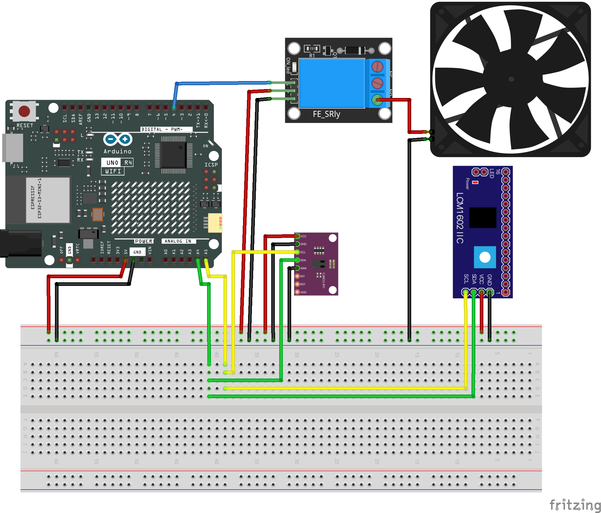

# CO2-Sensor

## Description

This is a simple Arduino sketch to control a CCS811 air quality sensor with LCD1602 display and a relay to turn on and off a fan when the CO2 level exceeds a threshold.

## Required Libraries

- `Adafruit_CCS811` - Library for CCS811 air quality sensor
- `Wire` - For I2C communication with the sensor (usually included with Arduino IDE)
- `LiquidCrystal_I2C` - For LCD1602 with I2C backpack
  
## Wiring

### Pin Connections

| Component | Arduino Pin |
|-----------|------------|
| CCS811 SDA | A4 (SDA) |
| CCS811 SCL | A5 (SCL) |
| CCS811 VCC | 3.3V |
| CCS811 GND | GND |
| LCD1602 SDA | A4 (SDA) |
| LCD1602 SCL | A5 (SCL) |
| LCD1602 VCC | 5V |
| LCD1602 GND | GND |
| Relay Signal | D4 |
| Fan +12V | Relay NO (Normally Open) |
| Fan GND | Power Supply GND |

### Fritzing Diagram

// Note: You'll need to create and add the actual wiring diagram image

### Note
Both the CCS811 and LCD1602 use I2C communication. Make sure they have different I2C addresses to avoid conflicts. The default address for:
- LCD1602 with I2C backpack is typically 0x27 or 0x3F
- CCS811 is typically 0x5A or 0x5B
