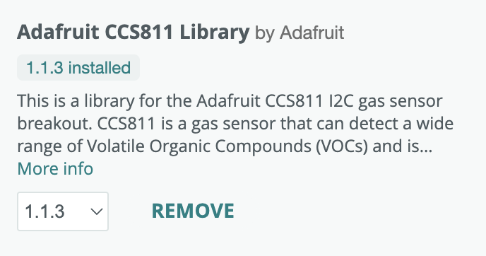
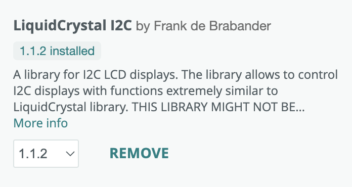
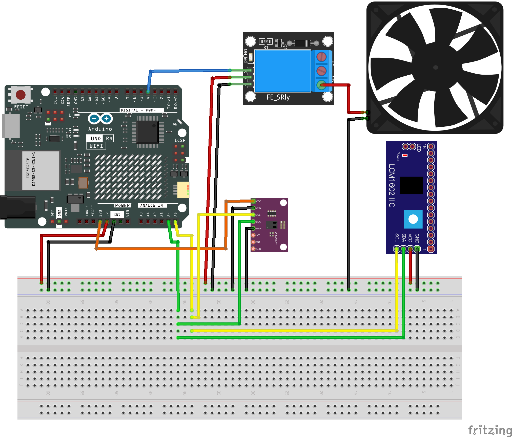

# CO2-Sensor

## Description

This is a simple Arduino sketch to control a CCS811 air quality sensor with LCD1602 display and a relay to turn on and off a fan when the CO2 level exceeds a threshold.

## Required Libraries

- Wire - For I2C communication with the sensor (usually included with Arduino IDE)
- [Adafruit_CCS811](https://github.com/adafruit/Adafruit_CCS811) - Library for CCS811 air quality sensor

- [LiquidCrystal_I2C](https://github.com/johnrickman/LiquidCrystal_I2C) - For LCD1602 with I2C backpack

  
## Wiring

### Pin Connections

| Component | Arduino Pin |
|-----------|------------|
| CCS811 & LCD1602 SDA | A4 (SDA) |
| CCS811 & LCD1602 SCL | A5 (SCL) |
| CCS811 VCC | 3.3V |
| CCS811 GND | GND |
| LCD1602 VCC | 5V |
| CCS811 & LCD1602 & Relay GND | GND |
| Relay Signal | D4 |
| Relay VCC | 5V |
| Fan +12V | Relay NO (Normally Open) |
| Fan GND | Power Supply GND |

### Fritzing Diagram

// Note: You'll need to create and add the actual wiring diagram image

### Note
Both the CCS811 and LCD1602 use I2C communication. Make sure they have different I2C addresses to avoid conflicts. The default address for:

- LCD1602 with I2C backpack is typically 0x27 or 0x3F
- CCS811 is typically 0x5A or 0x5B
